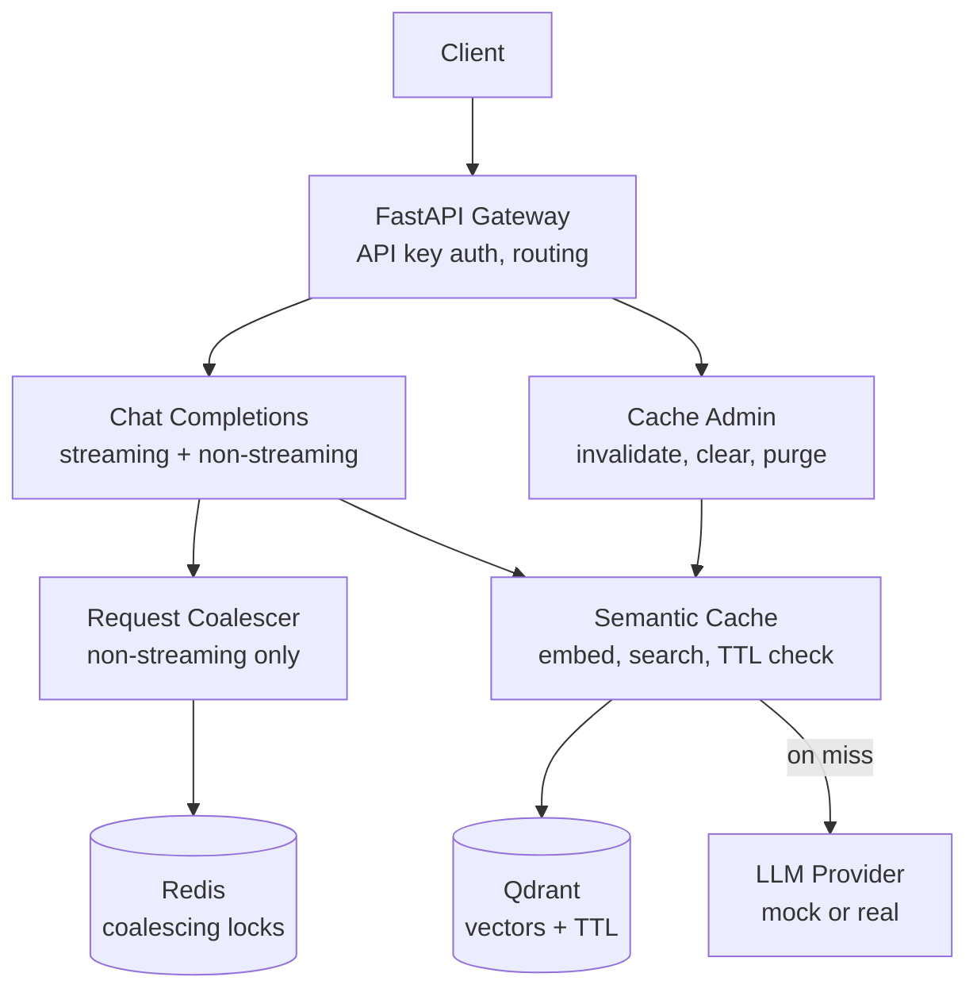

# SemCache

A semantic caching gateway for LLM APIs — cuts inference cost and latency by
recognizing when a new prompt means roughly the same thing as one it's
already answered, instead of caching only exact string matches.

## Why this exists

Every call to an LLM costs money and takes a couple of seconds. In any
real application, a meaningful fraction of user prompts are semantically
identical to ones already asked — "what is a semantic cache?" and "can you
explain what a semantic cache is?" mean the same thing, but a naive cache
keyed on exact text would treat them as two separate, billable requests.

SemCache sits between your application and any LLM provider, recognizes
near-duplicate prompts via vector similarity search, and serves a cached
response instead — while staying safe under concurrency, respecting TTLs,
and supporting real-time streaming.

## What it actually does

- **Semantic caching** — embeds prompts and searches a vector store for a
  close match (cosine similarity ≥ 0.95, empirically validated, not
  guessed) instead of requiring an exact string match.
- **In-flight request coalescing** — if 20 identical requests arrive at
  once, only the first calls the LLM; the other 19 share that result.
  Backed by Redis so it's correct across multiple gateway replicas.
- **TTL + manual invalidation** — cached entries expire automatically, and
  can be invalidated on demand when the underlying answer is known to be
  stale, without waiting for the TTL.
- **Streaming cache replay** — a cache hit on a streamed response replays
  the *exact original chunk sequence*, not a re-chunked approximation, so
  the token-by-token experience is identical whether the answer is fresh
  or cached.
- **Production-shaped basics** — structured JSON logging, typed error
  responses for every failure mode, API-key auth, and a fully async
  request path with no accidental blocking calls.

## Architecture

Every box other than Client/Gateway/Redis/Qdrant is an interface
(`UpstreamLLMProvider`, `CacheService`, `VectorService`, `Coalescer`),
injected via FastAPI's `Depends()`. `app/dependencies.py` is the single
file that decides which concrete implementation backs each interface —
across every phase of this build, that's the only file that changed to
turn a new capability on.

## Measured results (not estimated)

| Metric | Value |
|---|---|
| Cache hit vs. miss latency | 2032ms → 9.16ms (**222x**) |
| Real paraphrase similarity | 0.955–0.984 cosine |
| Unrelated-prompt similarity | ~0.79–0.81 cosine (clean separation from the 0.95 threshold) |
| Concurrent coalescing | 20 genuinely simultaneous identical requests → 1 upstream call |
| Live load test | 15 concurrent requests, 1 miss + 14 coalesced, ~2.1s total (not 30s serially) |
| Test suite | 22 passed, 0 failed |
| Cold start | ~11s, one-time (embedding model load at process start) |

## Tech stack

Python 3.11+ · FastAPI · Qdrant (vector store) · Redis (coalescing) ·
spaCy (embeddings) · pytest / pytest-asyncio / fakeredis · Docker

## Project structure
semcache/
├── app/
│ ├── main.py # app assembly, exception handlers, lifespan
│ ├── config.py # env-driven settings
│ ├── auth.py # API-key dependency
│ ├── exceptions.py # UpstreamTimeoutError, CoalesceTimeoutError
│ ├── logging_config.py # structured JSON logging
│ ├── schemas.py # request/response contracts
│ ├── dependencies.py # DI wiring — the "what's real" file
│ ├── redis_client.py # Redis singleton (coalescing)
│ ├── sse.py # Server-Sent Events formatting
│ ├── utils.py # shared helpers
│ ├── llm/
│ │ ├── base.py # UpstreamLLMProvider interface
│ │ └── mock_provider.py # deterministic mock, no real API cost
│ ├── services/
│ │ ├── cache_service.py # CacheService interface + NoOp impl
│ │ ├── vector_service.py # VectorService interface
│ │ ├── qdrant_vector_service.py # Qdrant + spaCy implementation
│ │ ├── semantic_cache_service.py # ties cache + vector service together
│ │ └── coalescer.py # SingleFlight pattern (Redis + NoOp)
│ └── routers/
│ ├── health.py
│ ├── gateway.py # POST /v1/chat/completions
│ └── cache_admin.py # cache management endpoints
├── tests/ # 22 tests across 5 files
├── pyproject.toml # ruff + black config
├── Dockerfile
├── docker-compose.yml # app + redis + qdrant
├── requirements.txt / requirements-dev.txt
└── .env.example
